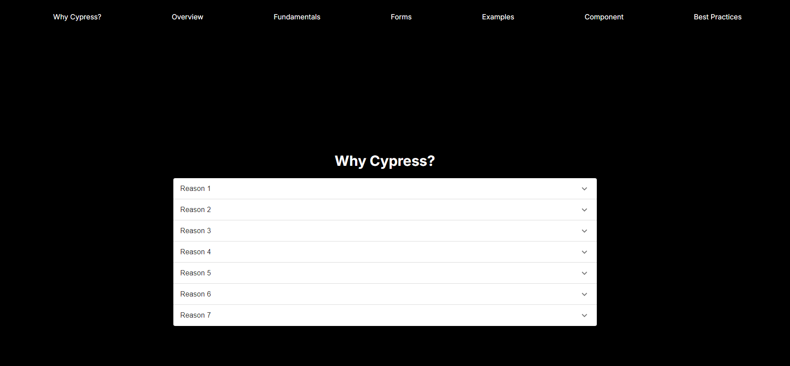

# Testing JavaScript with Cypress

This project uses **Cypress** for both **End-to-End (E2E)** and **Component Testing** for every page. The goal is to ensure that the application behaves as expected through comprehensive test coverage.

<div style="text-align:center;margin:30px auto;">
  
</div>

## Table of Contents

- [Introduction](#introduction)
- [Project Setup](#project-setup)
- [Cypress Installation](#cypress-installation)
- [Running Cypress](#running-cypress)
  - [End-to-End Testing](#end-to-end-testing)
  - [Component Testing](#component-testing)
- [Folder Structure](#folder-structure)
- [Writing Tests](#writing-tests)
  - [E2E Tests](#e2e-tests)
  - [Component Tests](#component-tests)
- [Best Practices](#best-practices)
- [Contributing](#contributing)
- [License](#license)

## Introduction

Cypress is a powerful JavaScript testing framework that simplifies writing both **E2E tests** and **component tests**. This project includes Cypress configuration for:
- Testing the functionality of every page.
- Running component tests for individual React components.

## Project Setup

### 1. Clone the repository:
```bash
git clone (repo url)
```

### 2. Install dependencies:

```bash
npm install
```

## Cypress Installation

Cypress is included as a development dependency in this project. However, if you need to install it manually, run:

```bash
npm install cypress --save-dev
```

After installation, open Cypress using the following command:

```bash
npx cypress open
```

## Running Cypress

There are two ways to run Cypress tests:

- End-to-End Testing (E2E)
- Component Testing

### End-to-End Testing
To run E2E tests:

```bash
npx cypress open
```

Choose the E2E Testing option from the Cypress UI, and select a browser to run tests in. Alternatively, you can run tests in headless mode:
```bash
npx cypress run
```
### Component Testing
To run component tests:
```bash
npx cypress open
```
Select the Component Testing option from the Cypress UI. It will run tests for the individual components in isolation.

## Folder Structure

### E2E Tests

E2E tests are stored in the cypress/e2e/ directory. Each page of the application has a corresponding Cypress test file.

### Component Tests

Component tests are stored in the cypress/component/ directory. These tests ensure that individual components render and behave as expected when isolated from the full application

## Writing Tests

### E2E Tests

E2E tests simulate real user behavior, navigating through the application and interacting with UI elements.

### Component Tests

Component tests verify the behavior of individual UI components in isolation.

## Best Practices

- Write tests for critical user flows such as login, registration, and checkout.
- Use Cypress fixtures to handle test data efficiently.
- Test edge cases, such as failed logins, empty states, and incorrect user inputs.
- Perform both E2E and component testing to achieve full test coverage.

## Contributing

If you'd like to contribute to this project, feel free to open a pull request. Ensure that all tests pass before submitting.


